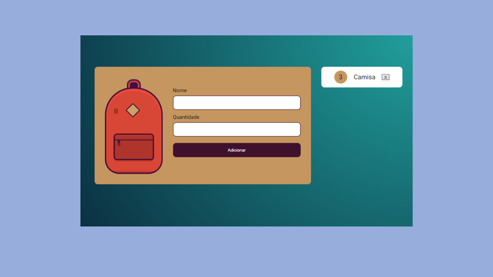

<h1 align="center"> Mochila</h1>

A Mochila de Viagem, é uma aplicação que simula uma mochila de viagem onde você pode adicionar ou
retirar itens de forma interativa, utilizando JavaScript para a funcionalidade e CSS para estilização visual.
 

  <a href="#-tecnologias">Tecnologias</a>&nbsp;&nbsp;&nbsp;|&nbsp;&nbsp;&nbsp;
  <a href="#-projeto">Projeto</a>&nbsp;&nbsp;&nbsp;|&nbsp;&nbsp;&nbsp;
  <a href="#-experimente">Experimente</a>&nbsp;&nbsp;&nbsp;|&nbsp;&nbsp;&nbsp;
  <a href="#%EF%B8%8F-licença">Licença</a>

  

 

  

## 🚀 Tecnologias

Esse projeto foi desenvolvido com as seguintes tecnologias:

- HTML
- CSS
- JavaScript

## 💻 Projeto

O projeto Mochila de Viagem Interativa é uma aplicação que permite aos usuários montarem virtualmente uma mochila de viagem.
Através da interação com os botões, é possível adicionar ou retirar itens da mochila.

## 🔗 Experimente

https://ofelia-1985.github.io/mochila-de-viagem/

## 🗝️ Licença

Esse projeto está sob a licença MIT.

---

Feito com ♥ 
